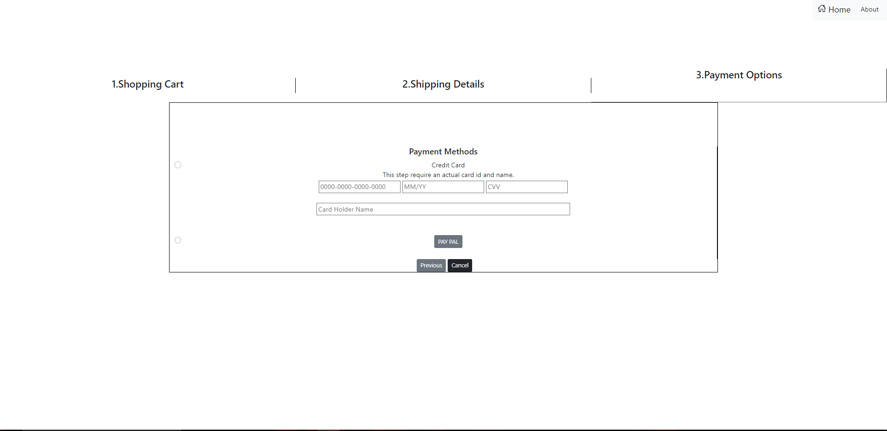

ONLINE SELLING CLOTHES SYSTEM (MINH AND HIS FRIENDS)

ASIGNMENT’S PLAN OF

` `GROUP 1

***TOPIC**: Design website for Online fashion shop which sells man and woman clothes*

PRJ301 - CLASS SE1615                 

::::::::::::::::::::::::

LIST OF MEMBERS IN GROUP 1

(Minh and his friends)

1. Lâm Tuấn Lạc
1. Vũ Văn Mạnh
1. Thẩm Hoàng Minh
1. Huỳnh Châu Hải Triều

***Assignment’s list of each member:***

1. Lâm Tuấn Lạc:
- *Draw site map and Frame Wire for web*

1. Vũ Văn Mạnh:
- *Gather information from some of websites on the internet.*

1. Thẩm Hoàng Minh:
- *Draw the ERD and design Data Base for web*

1. Huỳnh Châu Hải Triều:
- *Gather all of the information to create the plan.*

TABLE OF CONTENTS

1. ` `Customers.
1. ` `Target. 
1. ` `Features of website.
1. ` `GUI Wire Frame of website.
1. ` `Design web and Data Base
1. ` `Cart
1. ` `Custmers security information.
1. ` `Conclusion

\***

1. ***Customers:***
- People who want to buy some of clothes.
- The age higher than 12 years old.

1. ***Target:***
- Create the website to serve the work of buying and selling clothes.
- Bring the profit back to company.
- Catch up the modern fashion style.

\*

- *Design siteMap:*

\*

\*

- *About products:*
- Sell products: Hoddie, Dress, T-Shirt, Hat, Pant	
- Each type will have 40 to 50 items.

1. ***WEB feature:*** 
- In the view section for customers, there are functions divided by modules as follow: 	

1. *Items for sale and reference:* 
   1. Search by: Name, clothing material, category.
   1. Order by: price, category, name

1. ` `*Login and registration:*
   1. Design HTML and MVC forms for member registration or login information.
   1. Features to edit information such as: phone number, Email, address, Customer name

1. *Sales section:*
   1. Add products to cart.
   1. Display ( amount, total money, discount method).
   1. Enter delivery address.

- Admin section includes the following features: 

- Product editing section
  - Search by: Name, clothing material, category.
  - Add (product)
  - Delete (product)
  - Edit (product)

- The interface for Admin section is divided into menu including: 
  - Display product information
 
**

1. ***GUI Wire Frame of the website***

******

\***

***

`	`******
\***

1. ***System design and Data Base for web***
- ***Website design:***:  

- Optimized design for easy viewing by customers and saving time in design and maintenance.

- *Main Web Structure::* 
  - ` `File web page includes:
    - *META\_INF*   : contains context.xml 
    - *WEB\_INF*      : contains web.xml
    - *Assets*	       : contains html files
    - *CSS và Image* : contains css file and images
  - File Source Package includes:
    - *File Servlet* : contains File Servlet to interact with the client and the DB. 
    - *File Utils*     : not connected to DBS
- *Database structure:* 
- Create a DBS table for PRODUCT including: ID\_Pro (PK), Name\_of\_Pro, Style\_of\_Pro, Size, Material, Category, Prices, Sale, Date\_of\_Produce..

- Create a DBS table for CUSTOMER including: ID\_Cus (PK), Name\_Of\_Cus, Cus\_Phone\_Num, Cus\_Email, Sale\_Point.

- Create a DSB table for the order: ID\_Bill (PK), ID\_Cus (FK), ID\_Pro (FK), Amount, Date\_export, Total\_price ( amount \* price)

1. ***Cart:***

`	`+ **About products**: Customer's selected item, customer's information, expected delivery date, total order.

`	`+ **About customers**: customer's name, phone number, delivery address.

1. ***Customer information privacy policy***

\+ Customer information has been saved separately, avoiding the risk of information leakage due to carelessness.

***VI. Conclusion***

\+	Các phần ở trên là nhóm em tự thiết kế chỉ tham khảo 1 số web của các đơn vị bán hàng như TopShop để lên SiteMap và GUI Wire Frame. 

\+	Thầy thấy chỗ nào chưa hợp lý thầy giảng lại và chúng em sẽ rút kinh nghiệm. 

\+ All of parts above were designed by ourselves.

\+ We visted TopShop website to create SiteMap and Gui Wire Frame.

\+ If you see any unsense part please tell us and we wil fix to get more experiences. Thank you teacher. 
16

